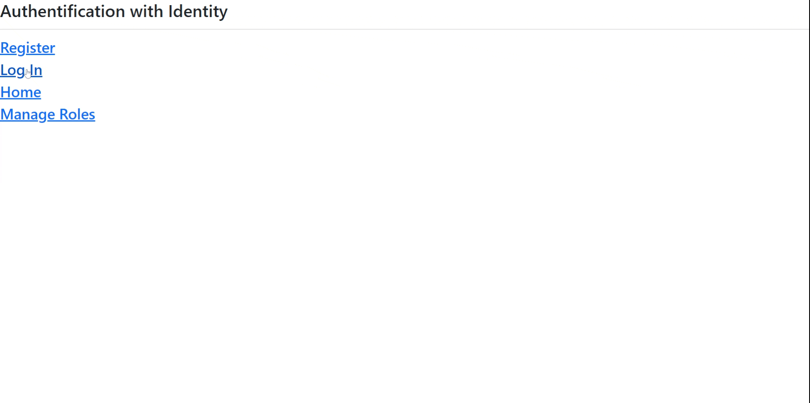
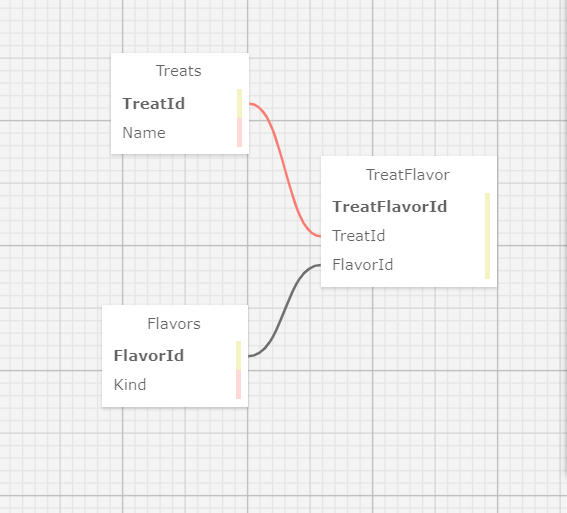

# Pierre's Sweet and Savory Treats





#### A web application with user authentication and a many-to-many relationship. The app should have the following features:
* User Authentication - All users have access to read functionality, but only logged in users can create, update, or delete.
* A many-to-many relationship between ```Treat``` models and ```Flavor``` models. Many treats can be many different flavors.
* A splash page with a list of each kind of treat and flavor, with links to see all the treats/flavors belonging to a single category.

#### By Thomas McDowell  

## Technologies Used:
* C#
* .NET 6.0
* MySql
* ASP.NET Core
* Entity Framework Core
* Pomelo Entity Framework Core
* HTML Helpers
* Custom Tag Helpers
* ASP.NET Identity

## Description:
This is a web application built with VS Code for the 11th Independent Code Review for Epicodus Coding program. There is a demonstration of a Many-to-Many relationship between Treats and Flavors, and an authorization level between general users, customers, and administrators. Administrators have control over the Create, Delete, and Update functions for Flavors and Treats. Customers and non-roled users have Read functionality. An unauthorized user will be redirected to an Access Denied page if they try to Create, Delete or Update.

At time of writing, Administrators are allowed to update roles, but I will do some more research on how to make that happen without exposing sensitive information in this README. Role-Based Authorization was explored by following a tutorial suggested by Epicodus at [yogihosting.com](https://yogihosting.com/aspnet-core-identity-roles/), but some modifications needed to be made in order to make their process compatible with a single-thread database connection via EF Core. Namely, the process outlined at YogiHosting for compling a list of Member and Non-Member users had to be subverted by compiling the list entirely before continuing on with the rest of that function in the Roles controller section. Secondly the Custom Tag Helpers had to be disabled because they caused the same code-crashing error (can't have multiple Sql connections running in parallel). There seems to be more documentation at YogiHosting that points to other tutorials in the same track that could clear up some of the confusion, but I didn't find the time to explore any deeper than Roles Authorization.

## Setup/Installation Req's:

### Set Up and Run Project
1. Clone this repo.
2. Open the terminal and navigate to this project's production directory called "PierresTreats". 
3. Within the production directory "PierresTreats", create a new file called `appsettings.json`.
4. Within `appsettings.json`, put in the following code, replacing the `uid` and `pwd` values with your own username and password for MySQL. For the LearnHowToProgram.com lessons, we always assume the `uid` is `root` and the `pwd` is `epicodus`.

```json
{
  "ConnectionStrings": {
      "DefaultConnection": "Server=localhost;Port=3306;database=pierres_treats;uid=[YOUR SQL USERNAME];pwd=[YOUR SQL PASSWORD];"
  }
}
```

5. Set up the Database. In your terminal in the project directory (PierresTreats.Solution/PierresTreats), run ```dotnet ef database update```

6. Run ```dotnet watch run``` to view the project in your web browser. Enter your computer password when prompted.

7. In order to see the app's full functionality, you will need to set up an Administrator. Do the following, otherwise, you will be redirected to an Access Denied page:
    *  Click the link "Create or manage an account" on the Home Page.
    *  Click the link "Register" on the view titled "Authentification with Identity."
    *  Enter an email address in the format ```name@place.com``` and a password consisting of 6 characters; a number, an upper and lower case letter, and a special character.
    *  Log in with that email and password using the link "Log In" on the "Authentification with Identity" page.
    *  Click the link "Manage Roles."
    *  Click the button labeled "Create a Role."
    *  Enter the word "Administrator" and click the button labeled "Create."
    *  Click the button labeled "Update."
    *  Toggle the checkbox corresponding to your entered email, then click the button labeled "Save."
   
9. Navigate back to the home page by clicking the link at the bottom of the screen.
10. Create, Delete, and Edit as you please with the Admin role. Add another user without a role to the site to see the Access Denied page.


## Known Bugs:
The implementation of User Roles is quite shaky. Following the tutorial at [yogihosting.com](https://yogihosting.com/aspnet-core-identity-roles/) is a bit frustrating, as they assume you're working from their previous tutorials using their asp.net setup. Given that this project is written with EF Core, it lead to some wonky workarounds. Presently, CustomTagHelpers don't work with this setup. I think they work as intended when commented in, but they crash the code when they are turned on. That being said, User Roles are working correctly, but there isn't a way to see which users are in which role without following the route to modify them (unless you toggle on TagHelpers...).

Initial test run had the wrong database link in the instructions, leading to the admin not being able to log in. This has been remedied. Initial Access Denied pathway didn't work, so it has been replaced with Try/Catch pairs in areas where only the Admins should have access.

## License:
MIT Copyright (C) 2023 Thomas McDowell

## Database Structure

